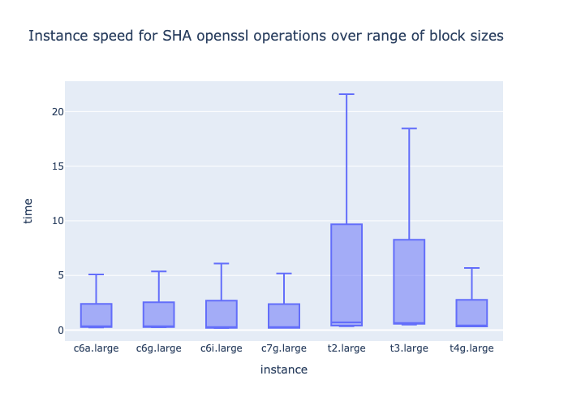
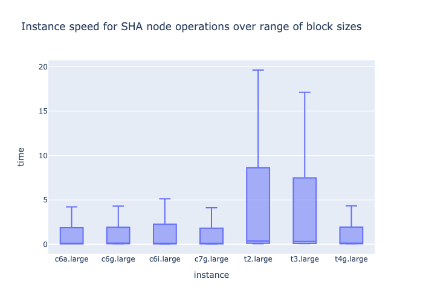
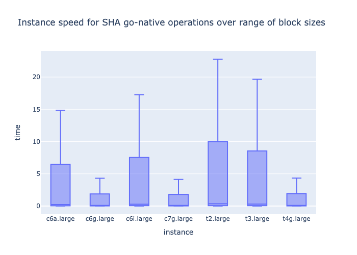
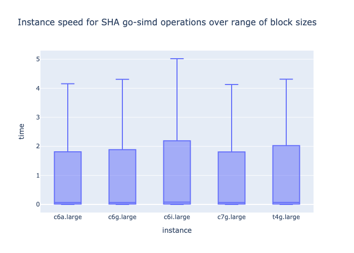
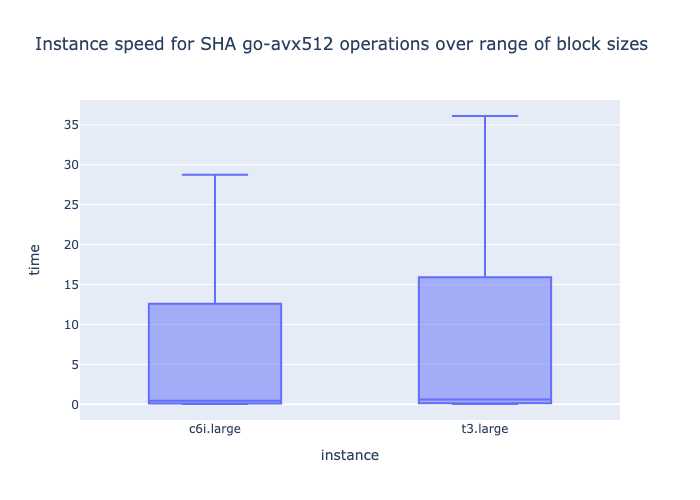
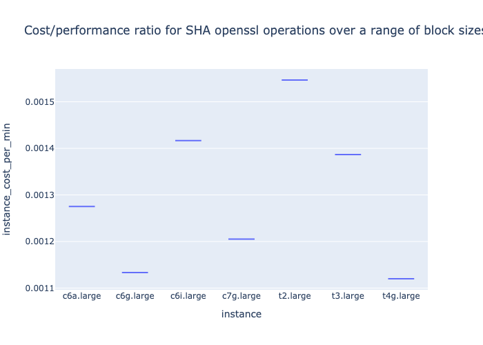

# Benchmarking SHA-256

Using commonly used libraries in Node, OpenSSL and Go using optional CPU capabilities on AMD64 (AVX-512, SHA) and ARM64 where available.

The utility is aimed to help benchmark bottlenecks in your application that heavily rely on SHA functions for calculating image hashes, user generated files and critical application logic that depends on calculating SHA-256 hashes.

## Dependencies

Confirm the following are installed:

* gcc
* go (version >1.18)
* node (version >16.13)

## Usage

Firstly build the required Go code and pull down packages required by node.

```
make
```

## Benchmarking

For benchmarking the utility is available to run on both amd64 (x86) and ARM. The benchmarking is isolated to a single core for gathering performance metrics.

```
make benchmark
```

The utility will loop by default 100 times over each of the following files:

* test-files/16K.bin 
* test-files/256K.bin
* test-files/1024K.bin
* test-files/16M.bin
* test-files/64M.bin
* test-files/256M.bin

The tool will benchmark the following:

* openssl
* node
* go (native ASM implementation for go >1.18)
* go (AVX-512, CPU capability if available)
* go (SHA, CPU capability if available)

## Performance conclusion

This benchmark simulates a straight-forward service which calculates the SHA sum of different file streams on disk, using 100 iterations each for 16K, 256K, 1024K, 16M and 64M block-sizes. This is intended to guide implementations that heavily use SHA in their application logic, such as uploaded submissions, collections of assets on disk, and user-generated input. 

In summary there is negligible difference between using the OpenSSL CLI tool, NodeJS, the native Golang SHA (ASM) implementation or Golang libraries using SIMD. The inbuilt OpenSSL library is highly optimised in machine-code for the target architecture, and third-party implementations such as the `minio/sha256-simd` are no longer faster than the native Go SHA rewrite in Go versions >1.18.

Surprisingly the Golang AVX-512 implementation on modern Intel CPU's suffered poor performance, possibly due to CPU thermal and voltage throttling and requires further investigation for analysis.

Newer ARM instances have the highest price/performance ratio for large-scale operations involving SHA calculations such as the AWS (Graviton2) instances `c6g.large` using ARM Neoverse N1, or the AWS (Graviton3) `c7g.large` Graviton3 instance type. In terms of performance, the c7g.large instance benchmarked the fastest.

# Analyzing the benchmark results

The directory `analytics/` contains Jupyter Notebooks that can be used to visualise the output data. Plots are saved as `.html` files in the `datavis/` directory.











### Cost/performance ratio for SHA openssl operations over a range of block sizes (us-east-1)



# Todo

- [ ] Test different SHA libraries:
    - [x] openssl CLI
    - [x] nodejs ([crypto library](https://nodejs.org/api/crypto.html), wrapper to openssl)
    - [x] go-native (version go1.18.6, [ASM SHA](https://groups.google.com/g/golang-codereviews/c/Xh3H-d5qE7U) implementation)
    - [x] go-simd (version go1.18.6, [sha256-simd](https://github.com/minio/sha256-simd) library)
    - [x] go-avx512 (version go1.18.6, [sha256-simd](https://github.com/minio/sha256-simd) library)
    - [ ] go-native (version go1.16, native go code implementation)
    - [ ] C (using openssl library)
    - [ ] GPU SHA implementation using Cuda
    - [ ] FPGA SHA implementation using AWS `f1` instance
- [ ] Improve cost/benefit analysis with normalised results
- [x] Test different instance types:
    - [x] c6a.large (AMD EPYC 7R13 Processor)
    - [x] c6g.large (Graviton2/ARM)
    - [x] c6i.large (Intel(R) Xeon(R) Platinum 8375C CPU @ 2.90GHz)
    - [x] c7g.large (Graviton3/ARM)
    - [x] t2.large (Intel(R) Xeon(R) CPU E5-2686 v4 @ 2.30GHz)
    - [x] t3.large (Intel(R) Xeon(R) Platinum 8259CL CPU @ 2.50GHz)
    - [x] t4g.large (Graviton2/ARM)
